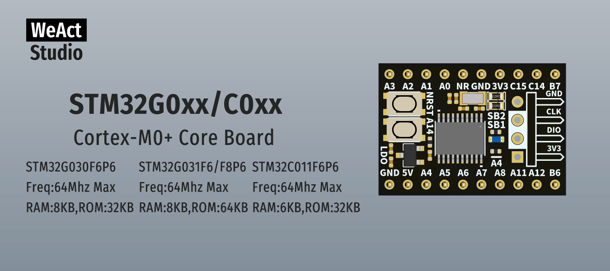

* [中文版本](./README_zh.md)
# WeActStudio.STM32G0xxC0xxCoreBoard

**STM32G030F6P6**  
Freq:64Mhz Max  
RAM:8KB,ROM:32KB  
**STM32G031F8P6**  
Freq:64Mhz Max  
RAM:8KB,ROM:64KB 
**STM32C0...**
TBD   

ST Official Website www.st.com

|Dir Name|Explain|
| :--:|:--:|
|Doc|DataSheet/ReferenceManual|
|Hardware|Hardware Development Kit|
|Examples|Software Examples|

```
/*---------------------------------------
- WeAct Studio Official Link
- taobao: weactstudio.taobao.com
- aliexpress: weactstudio.aliexpress.com
- github: github.com/WeActTC
- gitee: gitee.com/WeAct-TC
- blog: www.weact-tc.cn
---------------------------------------*/
```