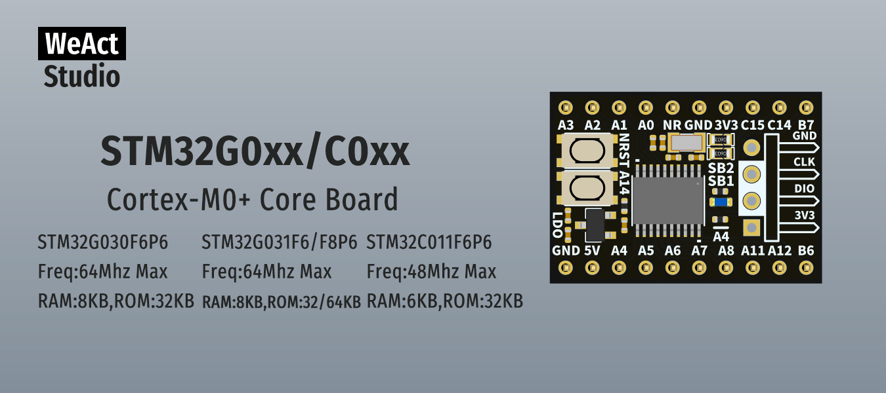

* [English version](./README.md)
# WeActStudio.STM32G0xxC0xxCoreBoard

**STM32G030F6P6**  
Freq:64Mhz Max  
RAM:8KB,ROM:32KB  
**STM32G031F8P6**  
Freq:64Mhz Max  
RAM:8KB,ROM:64KB  
**STM32G031F6P6**  
Freq:64Mhz Max  
RAM:8KB,ROM:32KB  
**STM32C011F6P6**  
Freq:64Mhz Max  
RAM:6KB,ROM:32KB   

ST 官方网站 Website www.st.com

|目录名称|内容|
| :--:|:--:|
|Doc| 数据手册/参考手册|
|Hardware| 硬件开发资料|
|Examples|软件例程|

```
/*---------------------------------------
- WeAct Studio Official Link
- taobao: weactstudio.taobao.com
- aliexpress: weactstudio.aliexpress.com
- github: github.com/WeActStudio
- gitee: gitee.com/WeAct-TC
- blog: www.weact-tc.cn
---------------------------------------*/
```